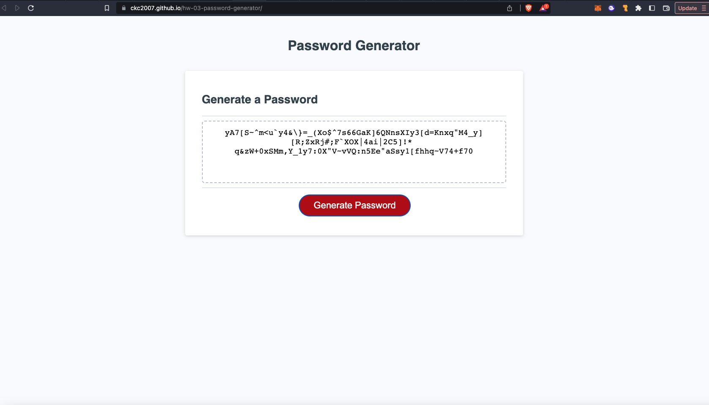

# 03 JavaScript: Password Generator

```
A password generator that takes user input for selected criteria, and returns a randomized password that meets those criteria.
```

## Description

```
User inputs the desired length of the password (between 8 and 128 characters),
User selects at least one character type (upper Case, lower Case, numeric, or special characters)
The password generator will disply the password in the text area.
```

## User Story

```
AS A client that wants to generate a strong randomized user password
I WANT to select the length, and character types to include in this password
SO THAT when i click on the generate password button, a unique and randomized password that meets all my input criteria is produced as a string value.
```
## Deployed Page

[https://ckc2007.github.io/hw-03-password-generator/]




```

The above is a screenshot of the deployed page

```

## User Story

```
AS A coding student
I WANT to take a timed quiz that tests my knowledge on JavaScript Fundamentals
SO THAT I can have a fun way of tracking my progress against myself and my peers.
```

## Acceptance Criteria

```
GIVEN I am taking the coding quiz
WHEN I click the start button
THEN a timer starts a countdown and I am given the first question
WHEN I answer this question by clicking on the answer buttons
THEN I am taken to the next question
WHEN all questions are completed, or the timer reaches 0
THEN the game is complete
WHEN the game is complete
THEN I can save my initials and my score (best time)
```